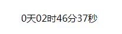

## vue-countdown

### Install

```bash
npm install vue-countdown2 -S

yarn add vue-countdown2
```

### QuickStart
```javascript
require('vue-countdown/dist/vue-countdown.css');

// in ES6 modules
import { countdown } from 'vue-countdown';

// in CommonJS
const { countdown } = require('vue-countdown');

// in Global variable
const { countdown } = VueCountdown;

Vue.component('c-countdown',countdown);
```
```html
<c-countdown :starttime="startTime" :endtime="endTime" :second="true"></c-countdown>
```

### Params

`props`
- `starttime`: the count down startTime,type Number,unit is millisecond
- `endtime`: the count down entTime,type Number,unit is millisecond
- `second`: type Boolean,whether to show seconds

### Preview

